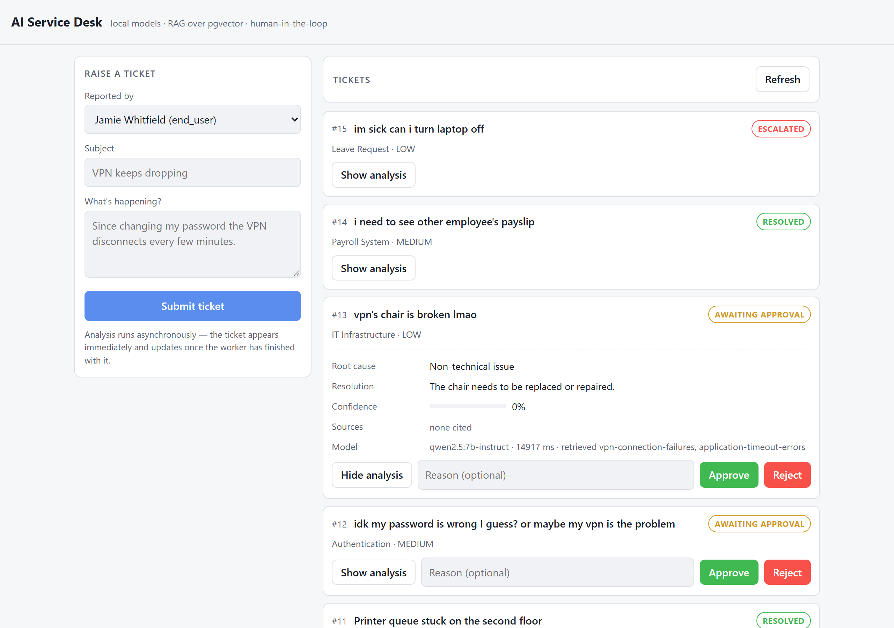
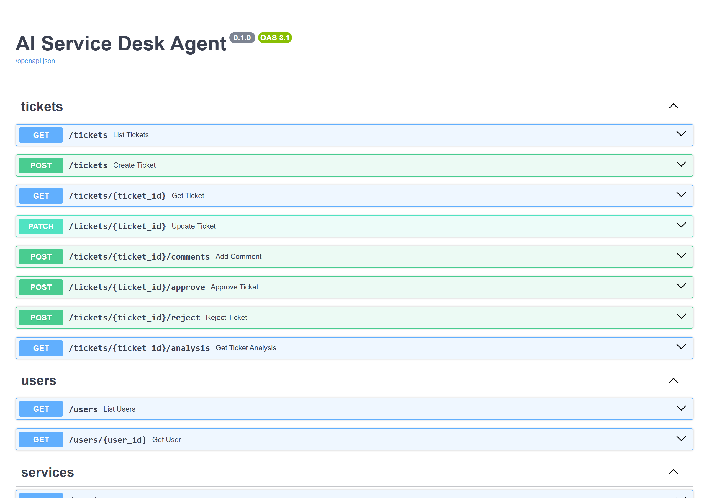

# Demo walkthrough

Screenshots of the running system, and what each one is evidence of. Captured
with `docs/capture_screenshots.py` against a live stack, so they can be
regenerated after a UI change instead of quietly going stale.

Every ticket below was analysed by `qwen2.5:7b-instruct` running locally. No
paid API, no network egress, no API key.

---

## 1. The ticket list


**What you're looking at:** every ticket and the state it reached. The form on
the left submits a new one.

**Point at:** the badges, and the line under each one. `RESOLVED`,
`AWAITING_APPROVAL`, `ESCALATED` — the same ticket type does not always land in
the same place, because where it lands depends on evidence and confidence, not
on the category.

Then point at the difference between *"Priya Nandakumar approved the agent's
proposed action — ill see what i can do"* and *"Auto-recommended — no human
review required"*. Both are `RESOLVED`. Only one of them was decided by a
person.

**Talking point — "who actually made this decision?"**
This line was added because a screenshot made its absence obvious: the list
showed `RESOLVED` identically whether the AI recommended it or an agent signed
it off, and that is the single distinction a human-in-the-loop system must not
hide. It comes from `GET /approvals`, one joined query for the whole list
rather than a lookup per row.

**Talking point — "approved what, exactly?"**
The wording is *"X approved the agent's proposed action"*, not *"Approved by
X"*, and the buttons say **Approve action** rather than **Approve**. That is
not fussiness. What a reviewer approves is the agent's recommendation, and that
recommendation is frequently a *refusal*. On a ticket titled *"can i check your
payslip"*, a bare "Approved by Jamie Whitfield" reads as *Jamie granted the
request* — the precise opposite of an action that says deny it.

The gate fired correctly, the database recorded it correctly, and the screen
still told the wrong story. Worth saying out loud: the hard part of
human-in-the-loop is not building the gate, it is making the decision legible
afterwards, because in a real incident review the record is all anyone has.

**Talking point — "why is this asynchronous?"**
A local model takes 2-15 seconds to answer. Doing that inside the HTTP request
would make the person raising a ticket wait for it. Instead the API saves the
ticket, publishes to RabbitMQ and returns immediately; a separate worker
process picks it up whenever it is free. The list updates on its own because
the state genuinely changes in the background. That is also why the API and the
worker are separate containers rather than one process: they fail, scale and
deploy independently.

---

## 2. An answer the system refused to act on


**What you're looking at:** ticket #14 — *"i need to see other employee's
payslip"* — with its analysis expanded.

**Point at, in this order:**

- **Resolution:** *"Deny the request as it violates company policy on data
  privacy."* The model was right.
- **Confidence: 30%.** It was not sure.
- **Sources: none cited.** Nothing in the knowledge base supported it.
- **retrieved nothing.** Retrieval returned zero articles, because nothing was
  close enough to be relevant.

**Talking point — "what stops it hallucinating?"**
This is the strongest single frame in the project. The model produced a correct,
sensible answer, and the system still refused to act on it automatically,
because a correct-sounding answer with no supporting evidence is
indistinguishable from a confident wrong one. Three separate rules each
independently forced a human review here: the subject is sensitive (payroll,
payslip), no sources were cited, and confidence was below threshold.

It is marked `RESOLVED` because a human then approved it — the audit log
records `human_approved` with the agent's id and their reason. The AI did not
close this ticket.

**Follow-up worth volunteering:** the retrieval trace (`retrieved …`) is shown
next to the citations deliberately. "What it cited" and "what it was actually
shown" being different is how you catch invented evidence. Across the 40-case
evaluation set, the rate of citing a document that was never retrieved is 0%.

---

## 3. Held back for a human



**What you're looking at:** ticket #13 — *"vpn's chair is broken lmao"* — a
deliberately out-of-scope question, typed casually.

**Point at:** confidence **0%**, **none cited**, and yet the two retrieved
articles are about VPN connections. The embedding matched on the word "vpn",
retrieval handed over the nearest things it had, and the model correctly
declined to pretend they were relevant.

**Talking point — "what happens when retrieval returns nothing useful?"**
The prompt says so explicitly rather than leaving an empty section: a model
handed a blank space falls back on its own memory, whereas a model told plainly
that it has no supporting evidence returns low confidence. Then the gate does
the rest. "I don't know" is a first-class outcome here, not a failure — the
approval buttons and the reason field are what turn it into a human decision
rather than a dead end.

---

## 4. The API



**What you're looking at:** the OpenAPI explorer at `/docs`, generated from the
code rather than written.

**Talking point — "how do you know the model's output is the right shape?"**
The `TicketAnalysis` schema documented on this page is the same Pydantic model
the model's JSON is validated against. One definition serves validation and
documentation both. It sets `extra="forbid"`, so a model that invents an extra
field fails validation rather than having that field silently dropped — drift is
a reason to retry, not something to shrug at.

---

## 5. The queues

No screenshot needed, and the command-line view is better than the web one
because it shows the routing arguments the management UI hides:

```
$ docker compose exec rabbitmq rabbitmqctl list_queues name messages consumers arguments

name                 messages  consumers  arguments
ticket.dead-letter   15        0          []
ticket.retry         0         0          [{"x-dead-letter-exchange",[]},
                                           {"x-dead-letter-routing-key","ticket.processing"}]
ticket.processing    0         1          []
```

**Point at, in this order:**

- **`ticket.processing`, 1 consumer.** That's the worker. One process, doing
  the work, separate from the API.
- **`ticket.retry` carries a dead-letter exchange back to `ticket.processing`.**
  This is the whole retry mechanism and there is no retry code anywhere. A
  failed message is published here with a TTL; when the TTL expires RabbitMQ
  dead-letters it, and the routing key sends it straight back to the work
  queue. The broker does the waiting.
- **`ticket.dead-letter`, 15 messages, 0 consumers.** Nothing consumes it and
  nothing is meant to. A message that arrives here is one no retry could ever
  fix — an unparseable body, or a ticket id that doesn't exist. Most of these
  are from test runs that share this broker (see the known limitation in the
  README), which is the DLQ doing its job for an unrecognised reference.

**Talking point — "what happens when the model is down?"**
Nothing is lost and nothing spins. The message goes to `ticket.retry`, sits
there for its TTL, and comes back on its own. After three attempts it stops
being retried and lands somewhere a person can look at it. The queue topology
*is* the retry policy — worth saying, because the instinct is to write a
`while` loop with `sleep` in it.

## A screen worth adding yourself

**n8n — http://localhost:5679** → the *SLA chaser* workflow, **Executions**
tab. Open a completed run and screenshot it as `media/06-n8n-workflow.png`.

Worth capturing that one specifically rather than the editor view: an execution
shows the item counts on each connection (`16 items` into the filter, `6` out)
and the run counts on each node, so the whole flow is legible without opening
anything. It needs the n8n account, which is yours and isn't in this repo.

**Talking point — "why n8n and not just more Python?"**
It only ever receives a webhook from the worker and calls back into the API to
approve or reject. It never touches Postgres or RabbitMQ. That keeps the
business rules in one place and n8n as thin glue for the things it is genuinely
good at: notification, branching, waiting on a person.

---

## Known rough edges

Worth saying out loud rather than being caught by them:

- The evaluation set still only references the original 8 knowledge articles,
  so the 12 added later are not exercised by it.
- Category accuracy moved 87.5% -> 81.2% between two runs with no change to
  categorisation code. That is single-run variance, and a serious evaluation
  would average several runs per case.
- `INJECTION_MARKERS` is a blocklist. It stopped all twelve attacks in
  `eval/injection_results.md`, and rephrasing would get past it. It raises the
  cost of an attack; it is not a boundary.
- Prompt hardening showed no measurable effect on that run — the model reported
  confidence 1.00 on the same cases as before. Every attack was stopped by the
  deterministic checks. Worth saying plainly rather than claiming three fixes
  all worked.
- The adversarial set is 12 cases and one run each. Enough to find a real bug,
  not enough to claim a rate.
